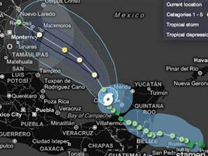

solutions-geoevent-java 
====================

The solutions-geoevent-java repository includes custom connectors for use with [ArcGIS GeoEvent Processor for Server](http://www.esri.com/software/arcgis/arcgisserver/extensions/geoevent-extension). 

## Features

Adapters
* [Common Alert Protocol (CAP) Adapter](solutions-geoevent/adapters/CAP-adapter/README.md)
* [CoT Adapter](solutions-geoevent/adapters/cot-adapter/README.md)
* [Exploitation Support Data (ESD) Adapter](solutions-geoevent/adapters/esd-adapter/README.md)
* [Geomessage Adapter](solutions-geoevent/adapters/geomessage-adapter/README.md)
* [regex Text Adapter](solutions-geoevent/adapters/regexText-adapter/README.md)

Processors
* [Add XYZ Processor](solutions-geoevent/processors/addxyz-processor/README.md)
* [Bearing Processor](solutions-geoevent/processors/bearing-processor/README.md)
* [Buffer Processor](solutions-geoevent/processors/buffer-processor/README.md)
* [Ellipse Processor](solutions-geoevent/processors/ellipse-processor/README.md)
* [Event Volume Control Processor](solutions-geoevent/processors/eventVolumeControl-processor/README.md)
* [Event Joiner Processor](solutions-geoevent/processors/eventjoiner-processor/README.md)
* [Extract Point from Line](solutions-geoevent/processors/reduceLineToPoint-processor/README.md)
* [Query Report Processor](solutions-geoevent/processors/query-report-processor/README.md)
* [Range Fan Calculator](solutions-geoevent/processors/rangefan-processor/README.md)
* [Symbol Lookup Processor](solutions-geoevent/processors/symbol-lookup-processor/README.md)
* [unitConverter Processor](solutions-geoevent/processors/unitConversion-processor/README.md)
* [Update Only Processor](solutions-geoevent/processors/updateOnly-processor/README.md)
* [Visibility Processor](solutions-geoevent/processors/visibility-processor/README.md)

Transports
* [IRC Transport](solutions-geoevent/transports/irc-transport/README.md)
* [TCP Squirt Transport](solutions-geoevent/transports/tcpSquirt-transport/README.md)

## Sections

* [Requirements](#requirements)
* [Instructions](#instructions)
* [Resources](#resources)
* [Issues](#issues)
* [Contributing](#contributing)
* [Licensing](#licensing)

## Requirements

* ArcGIS GeoEvent Processor (GEP) for Server
* ArcGIS Geoevent Server Software Development Kit (SDK) - the SDK is included with the Geoevent Server installation
* Java Development Kit (JDK) 1.6 or greater
* [Apache Maven](http://maven.apache.org) (you may follow the GES SDK documentation to learn how to set up a Maven repository)
* Notes on individual projects
    * Individual projects may have additional requirements. See the Readme for [each project](#features) for more information.
    * Some project have a dependency on the ArcGIS Runtime for Java SDK in order to run standalone Maven Tests. See the Readme for [each project](#features) for more information.

## Instructions

### General Help

* [New to Github? Get started here.](http://htmlpreview.github.com/?https://github.com/Esri/esri.github.com/blob/master/help/esri-getting-to-know-github.html)

### Building All Adapters and Processors
 
* Verify that Maven is installed and working correctly
    * From a command prompt, type `mvn -version` and verify that it returns the version correctly
    * If the Maven version is not returned correctly, consult the GEP SDK Developer Guide for more information on how to set up Maven. 
* Make any necessary changes to the pom.xml files to reflect the location of the GEP Server and GEP SDK repositories
    * If necessary, change the locations for the repository entries in the pom.xml 
    * The current settings assume these will be located at 
        * /Program Files/ArcGIS/Server/GeoEventProcessor/sdk/repository
        * /Program Files/ArcGIS/Server/GeoEventProcessor/system
* Depending on the version of software you have installed, you may also need to change the version property in the pom.xml files
* From a command prompt go to the `./solutions-geoevent-java/solutions-geoevent` directory
* Type `mvn install` at the prompt and hit return
* Each installed module will now have a target folder (see each module's Readme.md for the exact path)
* Browse to each target directory 
* Copy the .jar file from the target folder and paste it into the deploy directory on your GEP installation (ex. <GEP install location>\deploy\ -- default location is C:\Program Files\ArcGIS\Server\GeoEventProcessor\deploy)
 
### Validating Install
 
* Open the GeoEvent Processor Manager 
* Navigate to 'Site' > 'Components' >  'Adapters'
    *  You should see each newly installed adapter as one of the available adapters
* Navigate to 'Site' > 'Components' >  'Processors' 
    * You should see each newly installed processor as one of the available processors

## Resources

* Learn more about Esri's [ArcGIS GeoEvent Processor for Server Resource Center](http://pro.arcgis.com/share/geoevent-processor/)
* Learn more about [Extending ArcGIS GeoEvent Processor](http://resources.arcgis.com/en/help/main/10.2/index.html#//015400000664000000)
* Learn more about Esri's [ArcGIS for the Military](http://solutions.arcgis.com/military/)

## Issues

Find a bug or want to request a new feature?  Please let us know by submitting an issue.

## Contributing

Esri welcomes contributions from anyone and everyone. Please see our [guidelines for contributing](https://github.com/esri/contributing).

## Licensing

Copyright 2013 Esri

Licensed under the Apache License, Version 2.0 (the "License");
you may not use this file except in compliance with the License.
You may obtain a copy of the License at

   [http://www.apache.org/licenses/LICENSE-2.0](http://www.apache.org/licenses/LICENSE-2.0)

Unless required by applicable law or agreed to in writing, software
distributed under the License is distributed on an "AS IS" BASIS,
WITHOUT WARRANTIES OR CONDITIONS OF ANY KIND, either express or implied.
See the License for the specific language governing permissions and
limitations under the License.

A copy of the license is available in the repository's
[license.txt](license.txt) file.

