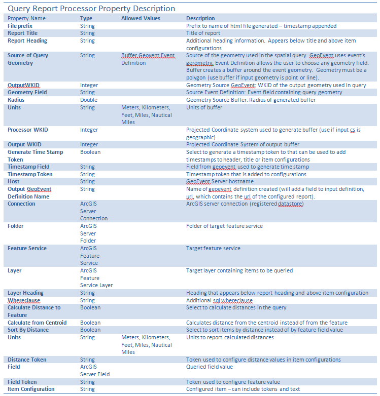
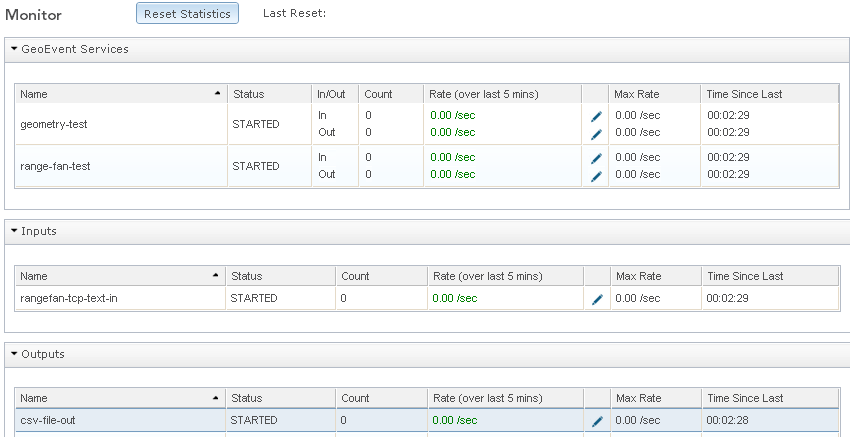

# Geometry Processors

The Geometry Processors demonstrate how to extend GeoEvent Processor to build custom processors that perform actions and processing on the geometries of a GeoEvent Service.  

## Features 

* Query Report Processor - Executes a spatial query on feature services registered in GeoEvent Processor's data store.  The author of the service can then configures a report based on returned features.

## Sections

* [Requirements](#requirements)
* [Building](#building)
* [Installation](#installation)
* [Testing](#testing)
* [Licensing](#licensing)

## Requirements

* See common [solutions-geoevent-java requirements](../../../README.md#requirements).
* The ArcGIS Runtime for Java SDK is required in order to run the standalone Maven Tests included with this project.

## Building 

* See the [solutions-geoevent-java instructions](../../../README.md#instructions) for general instructions on 
    * verifying your Maven installation
    * setting the location of GeoEvent Processor and GeoEvent Processor SDK repositories
    * and any other common required steps
* Open a command prompt and navigate to `solutions-geoevent-java/solutions-geoevent/processors/query-report-processor`
    * Enter `mvn install` at the prompt.

## Installation

* Install the Geometry Processors.
    * Browse to `solutions-geoevent-java/solutions-processors/query-report-processor/target` (this directory is created when you execute mvn install).
    * Copy the .jar file and paste it into the deploy folder in the GeoEvent Processor install directory ([GeoEvent Processor install location]\deploy\ -- default location is C:\Program Files\ArcGIS\Server\GeoEventProcessor\deploy).
* Check for existing GeoEvent Definitions.
    *  Open GeoEvent Processor Manager.
    *  Navigate to ‘Site’ > ‘GeoEvent Processor’ > ‘GeoEvent Definitions’.
    *  Confirm GeoEvent Definition(s) exist for the processor(s) you want to run (e.g. if you are going to run the Buffer Processor, confirm a GeoEvent Definition is available as illustrated below).

* If these GeoEvent Definitions are not available, do the following to create these GeoEvent Definitions.
    *  Navigate to ‘Site’ > ‘GeoEvent Processor’ > ‘Configuration Store’ and click ‘Import Configuration’.
    *  Browse to `solutions-geoevent-java\data\configurations` and locate the `GeoEventDefinitions-GeometryProcessors.xml` configuration file. This file is located [here](../../../data/configurations/GeoEventDefinitions-GeometryProcessors.xml).
    *  On the Import Configuration dialog, click Import.

## Testing

### Validating the Installation
 
* See the [solutions-geoevent-java validation instructions](../../../README.md#validating-install).
    * Ensure the Buffer, Ellipse, Range Fan, Visibility, Query Report, etc. processors exist.

### Testing with Simulated Test Data

* In the following steps you will configure GeoEvent Processor to receive and process simulated data.
* A prerequisite to using the Query Report processor is that an arcgis server instance must be registered with geoevent server. The AGS must contain a feature service hosting the layer on which the spatial query will be executed.  Additionally, the query geometry derived from the event geometry must intersect features in the feature layer that is queried.  See the ArcGIS sever help topic in ArcGIS Resources [here](http://resources.arcgis.com/en/help/main/10.2/#/Welcome_to_the_ArcGIS_10_2_for_Server_Windows_Help/0154000002np000000/) for more information on setting up an instance of ArcGIS Server and publishing feature services.
* Open GeoEvent Processor Manager.
* Go to Site > GeoEvent Processor > GeoEvent Services
* If not already present create a new GeoEvent definition called buffer
	*Click the 'New GeoEvent Definition' button
	*Configure the event definition using the following table (Note - uses the same geoevent definition as the buffer processor)
	 

	
* Create an Input Connector to receive simulated data over TCP.
    * Navigate to ‘Site’ > ‘Services’ > 'Inputs'.
    * Click Add Input and select 'Receive text from a TCP Socket' and configure as illustrated below.

* Next, create an Output Connector to observe the received data.
    * Navigate to ‘Site’ > ‘Services’ > 'Outputs'.
    * Select Add Input and select 'Write to JSON' and configure the properties.
* Create a simple GeoEvent Service to direct the input data to the output using the selected processor.
    * An example GeoEvent Service and processor configuration is illustrated below.

Description of Configuration Properties

*Fill in the required properties.
	*Select a file prefix for the html report you will generate (a timestamp will be appended to the file name so that the report is uniquely named).
	*Type in a title for the report
	*For the geometry source use 'Buffer' and select appropriate distance, units and wkid for the feature class you will be querying.
	*Type in the host name of geoevent server acceptable formats are <hostname>, https://<hostname>:6143, or https://<hostname>.  If the geoevent server is n the local machine, a hostname of localhost will suffice.
	*Select the Conection, Folder, Layer, Feature Service and Field for the service hosting the data you wish to query.
	*The Item Configuration will have a token '{$Item}'.  This token will be replaced in the report with text representing the field value for each returned feature.
* Since the query geometry must overlap the service being queried, the Geometry-Buffer.csv file located at solutions-geoevent-java\data\simulation_files\Geometry-Buffer.csv may need to be modified.
	*Open the Geometry-Buffer.csv in MS Excel or in a text editor of your choice.
	*Add new rows or change values in rows so that the x, y coordinates overlap the feature service geometry you wish to query.
* Using the GeoEvent Simulator, load the simulation file 
* In GeoEvent Processor Manager, navigate to 'Services' > 'Monitor' to observe that the values are increasing and the selected outputs are updated. 

* Go to Services > Output and stop the output service created above
* In the file browser go to the registered output folder and sort the contents by date.
* Open the most recent entry (if the query report processor is the only service writing to this location the most recent file should contain the json output of the test).
* Examine the output.  If the query report processor successfully created a report a field with the name configured in the processor properties will be present and the value will be the path to an html document.
* Open the file at the path above.  The result is the report configured in the processor properties.
* You can now test the processors with additional outputs such as published feature services.

## Licensing

Copyright 2013 Esri

Licensed under the Apache License, Version 2.0 (the "License");
you may not use this file except in compliance with the License.
You may obtain a copy of the License at

   [http://www.apache.org/licenses/LICENSE-2.0](http://www.apache.org/licenses/LICENSE-2.0)

Unless required by applicable law or agreed to in writing, software
distributed under the License is distributed on an "AS IS" BASIS,
WITHOUT WARRANTIES OR CONDITIONS OF ANY KIND, either express or implied.
See the License for the specific language governing permissions and
limitations under the License.

A copy of the license is available in the repository's
[license.txt](../../../license.txt) file.
