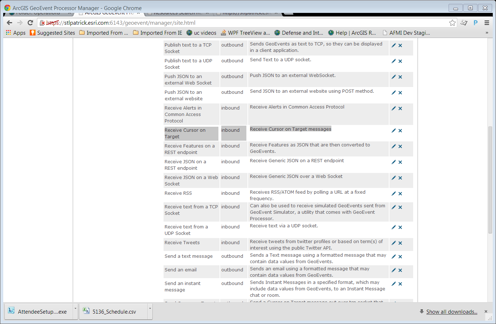
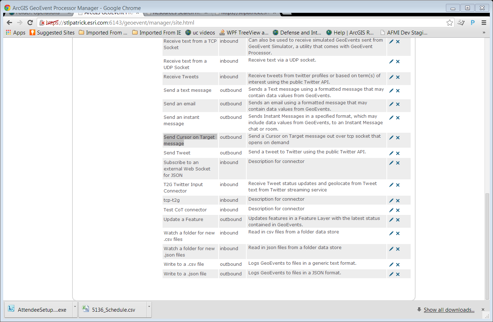
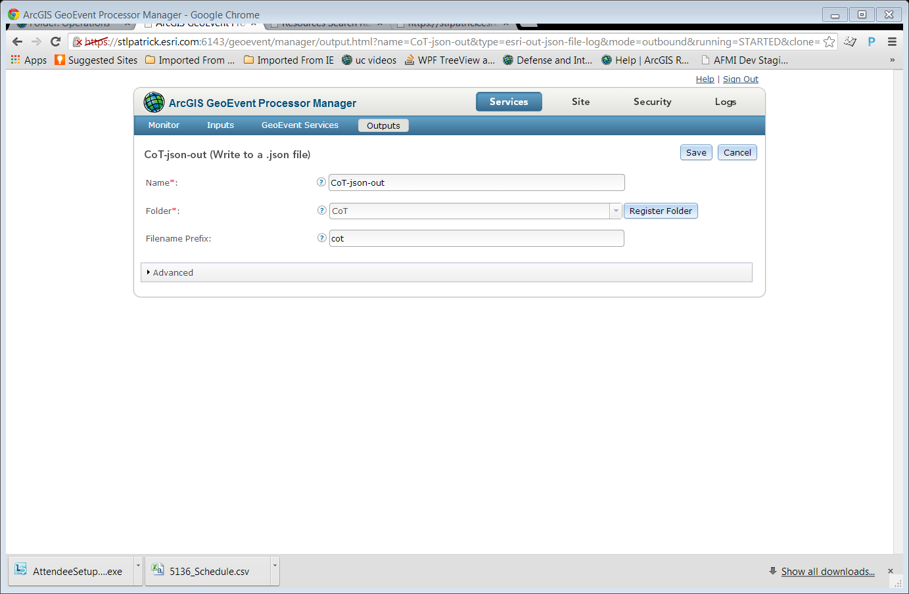
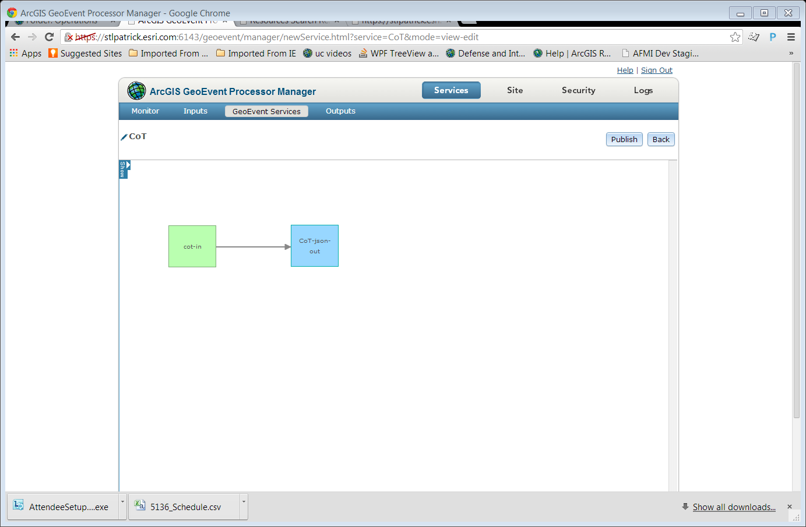

# CoT Adapter

The CoT Adapter provides an example of how to input Cursor on Target (CoT) XML messages as GeoEvents into ArcGIS GeoEvent Processor for Server.

## Features

* Receives XML messages conforming to the CoT message format.
* Converts messages received using available GeoEvent Definitions.

## Sections

* [Requirements](#requirements)
* [Building](#building)
* [Installation](#installation)
* [Testing](#testing)
* [Licensing](#licensing)

## Requirements

* See common [solutions-geoevent-java requirements](../../../README.md#requirements).
* There are no additional requirements for this project.

## Building 

* See the [solutions-geoevent-java instructions](../../../README.md#instructions) for general instructions on 
    * verifying your Maven installation
    * setting the location of GeoEvent Processor and GeoEvent Processor SDK repositories
    * and any other common required steps
* Open a command prompt and navigate to `solutions-geoevent-java/solutions-geoevent/adapters/cot-adapter`
    * Enter `mvn install` at the prompt.

## Installation

* Install the CoT Adapter.
    * Browse to `solutions-geoevent-java/solutions-geoevent/adapters/cot-adapter/target` (this directory is created when you execute mvn install).
    * Copy the .jar file and paste it into the deploy folder in the GeoEvent Processor install directory ([GeoEvent Processor install location]\deploy\ -- default location is C:\Program Files\ArcGIS\Server\GeoEventProcessor\deploy).

## Testing

### Validating the Installation
 
* See the [solutions-geoevent-java validation instructions](../../../README.md#validating-install).

### Testing with Simulated Test Data

* In the following steps you will configure GeoEvent Processor to receive and process simulated CoT messages.
    * Navigate to ‘Site’ > ‘GeoEvent Processor’ > 'GeoEvent Definitions'.
    * Note that a GeoEvent Definition named CoT was created for you when you deployed the CoT Adapter.

    * Navigate to ‘Site’ > ‘GeoEvent Processor’ > 'Connectors'.
    * Note a Receive Cursor on Target inbound connector that receives messages over HTTP was created when you deployed the CoT Adaptor. 

    * Note a Send Cursor on Target outbound connector that sends CoT messages over a TCP channel that opens on demand was created when you deployed the CoT Adaptor.

* Next use GeoEvent Processor Manager to:
    * Create a new input to receive CoT messages using the Receive Cursor on Target connector created when you deployed the CoT Adapter.
	* For the XSD_Path  property, use the location of the CoTtypes.xml downloaded from GitHub ([download location]/solutions-geoevent-java/solutions-geoevent/adapters/cot-adapter/src/main/resources/CoTTypes/CoTtypes.xml).
	* For the CoT_Types_Path property, use the location of the CoTtypes.xml downloaded from GitHub ([download location]/solutions-geoevent-java/solutions-geoevent/adapters/cot-adapter/src/main/resources/XSD-Add-on).

    * Create a new Output Connector to write data to a JSON file using the Write to a .json file connector (note: this is not the Send Cursor on Target outbound connector created when you deployed the CoT Adapter).

    * Use the input and output connectors above to create a simple GeoEvent Service that sends the input CoT messages to an output JSON file.

* Use an HTML poster application such as Firefox Poster (https://addons.mozilla.org/en-US/firefox/addon/poster/) to send messages to GeoEvent Processor.
    * Firefox Poster can be configured as illustrated below.

	* For the URL property, use the receiver endpoint of your CoT Input Connector in the form of: 'https://[host machine of geoevent processor]:6143/geoevent/rest/receiver/[name of input connector]'.    
	* Browse to the simulation_files folder downloaded from github ([install location]/solutions-geoevent-java\data\simulation_files).
	* Open one of the CoT simulation files (named CoT1.xml - CoT4.xml).
	* Copy and paste the contents into the content window of Firefox Poster.
	* Click on the POST button in Firefox Poster.
* In GeoEvent Processor Manager, navigate to ‘Services’ > ‘Monitor’. You should have received 1 input and sent 1 output (note: your names/outputs may differ).

* Repeat with the other simulation files if desired.
## Resources

* Learn more about Cursor on Target
    * [CoT](http://cot.mitre.org/index.html)

## Licensing

Copyright 2013 Esri

Licensed under the Apache License, Version 2.0 (the "License");
you may not use this file except in compliance with the License.
You may obtain a copy of the License at

   [http://www.apache.org/licenses/LICENSE-2.0](http://www.apache.org/licenses/LICENSE-2.0)

Unless required by applicable law or agreed to in writing, software
distributed under the License is distributed on an "AS IS" BASIS,
WITHOUT WARRANTIES OR CONDITIONS OF ANY KIND, either express or implied.
See the License for the specific language governing permissions and
limitations under the License.

A copy of the license is available in the repository's
[license.txt](../../../license.txt) file.
