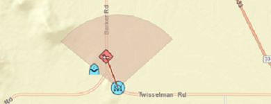

# Bearing Processor

The Geometry Processors demonstrate how to extend GeoEvent Processor to build custom processors that perform actions and processing on the geometries of a GeoEvent Service.  

## Features 

* Bearing Processor - Calculates a bearing in degrees between 2 point geometries or 2 sets of (x,y) coordinates.

## Sections

* [Requirements](#requirements)
* [Building](#building)
* [Installation](#installation)
* [Testing](#testing)
* [Licensing](#licensing)

## Requirements

* See common [solutions-geoevent-java requirements](../../../README.md#requirements).
* The ArcGIS Runtime for Java SDK is required in order to run the standalone Maven Tests included with this project.

## Building 

* See the [solutions-geoevent-java instructions](../../../README.md#instructions) for general instructions on 
    * verifying your Maven installation
    * setting the location of GeoEvent Processor and GeoEvent Processor SDK repositories
    * and any other common required steps
* Open a command prompt and navigate to `solutions-geoevent-java/solutions-geoevent/10.3.0/processors/bearing-processor`
    * Enter `mvn install` at the prompt.

## Installation

* Install the Bearing Processor.
    * Browse to `solutions-geoevent-java/solutions-geoevent/processors/10.3.0/bearing-processor/target` (this directory is created when you execute mvn install).
    * Copy the .jar file and paste it into the deploy folder in the GeoEvent Processor install directory ([GeoEvent Processor install location]\deploy\ -- default location is C:\Program Files\ArcGIS\Server\GeoEventProcessor\deploy).

## Testing

### Validating the Installation
 
* See the [solutions-geoevent-java validation instructions](../../../README.md#validating-install).
    * Ensure the Bearing Processor exists.

### Testing with Simulated Test Data

In GeoEvent Extension Manager 

* Go to the Site >> Configuration Store Tab. 
* Click the 'Import Configuration' button. 
* Select 'Choose File'
* Browse to the ./solutions-geoevent-java/data/configurations/ directory 
* Select the SolutionsComponentTestConfig.xml 
* Click 'Open' in the dialog. 
* Click 'Next'. 
* When prompted choose 'Import Configuration'. 

The test service configuration will be downloaded to your instance of GeoEvent. 

## Licensing

Copyright 2014 Esri

Licensed under the Apache License, Version 2.0 (the "License");
you may not use this file except in compliance with the License.
You may obtain a copy of the License at

   [http://www.apache.org/licenses/LICENSE-2.0](http://www.apache.org/licenses/LICENSE-2.0)

Unless required by applicable law or agreed to in writing, software
distributed under the License is distributed on an "AS IS" BASIS,
WITHOUT WARRANTIES OR CONDITIONS OF ANY KIND, either express or implied.
See the License for the specific language governing permissions and
limitations under the License.

A copy of the license is available in the repository's
[license.txt](../../../license.txt) file.

